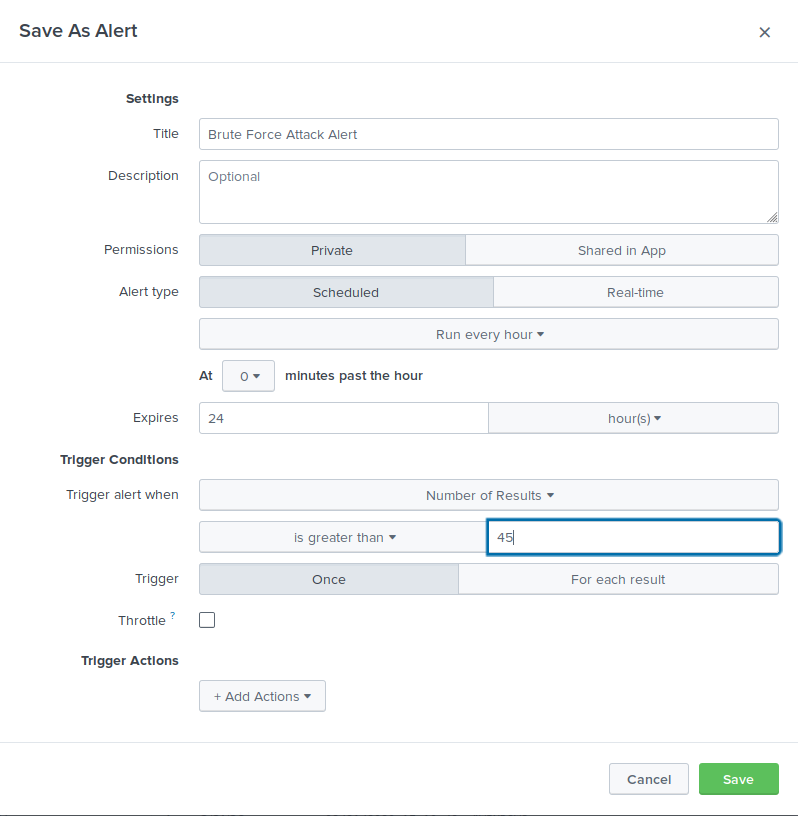

# Splunk_Assessment

In this activity, I was tasked with developing searches, custom reports and alerts to monitor Vandalay's security environment in order to protect them from future attacks.

## Scenario

You have just been hired as an SOC Analyst by Vandalay Industries, an importing and exporting company.

- Vandalay Industries uses Splunk for their security monitoring and have been experiencing a variety of security issues against their online systems over the past few months.

- You are tasked with developing searches, custom reports and alerts to monitor Vandalay's security environment in order to protect them from future attacks.

**System Requirements**

You will be using the Splunk app located in the Ubuntu VM.

**Your Objective**

Utilize your Splunk skills to design a powerful monitoring solution to protect Vandaly from security attacks.

**Topics Covered in This Assignment**

- Researching and adding new apps
- Installing new apps
- Uploading files
- Splunk searching
- Using fields
- Custom reports
- Custom alerts

## Vandalay Industries Monitoring Activity Instructions

### Step 1: The Need for Speed

**Background:** As the worldwide leader of importing and exporting, Vandalay Industries has been the target of many adversaries attempting to disrupt their online business. Recently, Vandaly has been experiencing DDOS attacks against their web servers.

Not only were web servers taken offline by a DDOS attack, but upload and download speed were also significantly impacted after the outage. Your networking team provided results of a network speed run around the time of the latest DDOS attack.

**Task:** Create a report to determine the impact that the DDOS attack had on download and upload speed. Additionally, create an additional field to calculate the ratio of the upload speed to the download speed.

- Upload the following file of the system speeds around the time of the attack.

   > [Speed Test File](Resources/server_speedtest.csv)

   

- Using the eval command, create a field called ratio that shows the ratio between the upload and download speeds.

   

- Create a report using the Splunk's table command to display the following fields in a statistics report:

   - _time
   - IP_ADDRESS
   - DOWNLOAD_MEGABITS
   - UPLOAD_MEGABITS
   - ratio

   

- Answer the following questions:

   - Based on the report created, what is the approximate date and time of the attack?

      - **Answer:** 02/20/2020 at 2:21 pm UTC to 02/24/2020 at 8:30 pm UTC.

   - How long did it take your systems to recover?

      - **Answer:** It took 4 days, 6 hours and 9 minutes for our systems to recover.

### Step 2: Are We Vulnerable?

**Background:** Due to the frequency of attacks, your manager needs to be sure that sensitive customer data on their servers is not vulnerable. Since Vandalay uses Nessus vulnerability scanners, you have pulled the last 24 hours of scans to see if there are any critical vulnerabilities.

- For more information on Nessus, read the following link: https://www.tenable.com/products/nessus

**Task:** Create a report determining how many critical vulnerabilities exist on the customer data server. Then, build an alert to notify your team if a critical vulnerability reappears on this server.

- Upload the following file from the Nessus vulnerability scan.

   > [Nessus Scan Results](Resources/nessus_logs.csv)

   

- Create a report that shows the count of critical vulnerabilities from the customer database server.

   - The database server IP is 10.11.36.23.
   - The field that identifies the level of vulnerabilities is severity.

   

- Create a report using the Splunk's table command to display the following fields of your results.

   
	
- Build an alert that monitors every day to see if this server has any critical vulnerabilities. If a vulnerability exists, have an alert emailed to soc@vandalay.com.

   > Step 1: Start the alert.

   

   > Step 2: Edit the email preferences.

   

   > Step 3: Submit the alert.

   

### Step 3: Drawing the (base)line

**Background:** A Vandaly server is also experiencing brute force attacks into their administrator account. Management would like you to set up monitoring to notify the SOC team if a brute force attack occurs again.

**Task:** Analyze administrator logs that document a brute force attack. Then, create a baseline of the ordinary amount of administrator bad logins and determine a threshold to indicate if a brute force attack is occurring.

- Upload the administrator login logs.

   > [Admin Logins](Resources/administrator_logs.csv)

   

- When did the brute force attack occur?

   - **Answer:** 2/21/2020 at 9:00 am to 2/21/2020 at 1:00 pm.

- Determine a baseline of normal activity and a threshold that would alert if a brute force attack is occurring.

   - **Answer:** We determined a baseline of 35 attempts per hour, with a threshold of 45 attempts per hour.

- Design an alert to check the threshold every hour and email the SOC team at SOC@vandalay.com if triggered.

   > Step 1: Start the alert.

   

   > Step 2: Edit the email preferences.

   

   > Step 3: Submit the alert.

   

